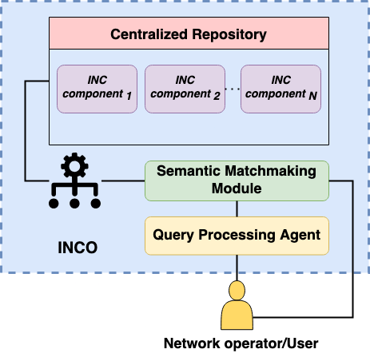
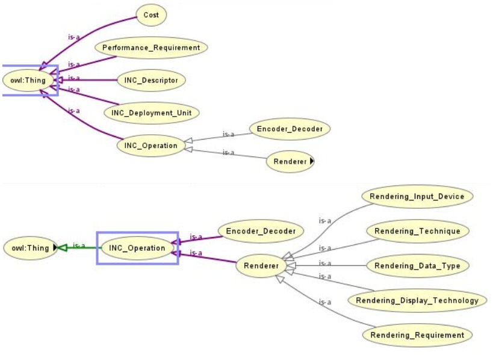
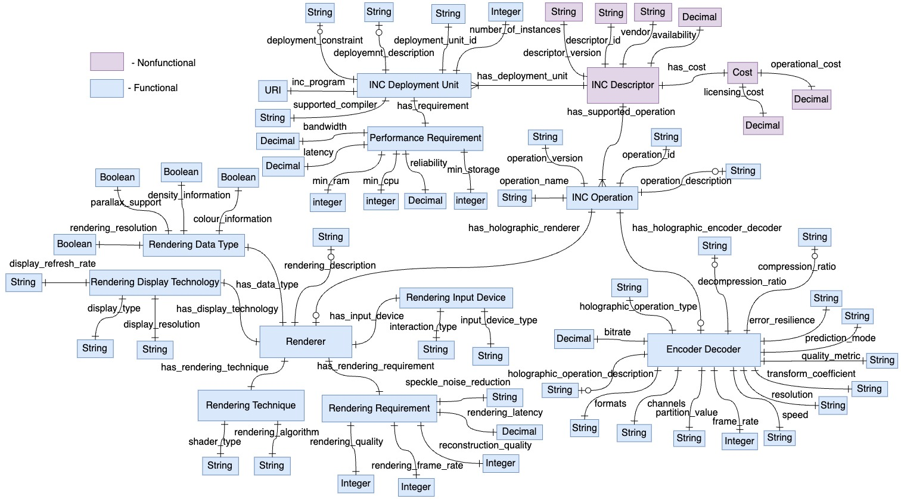

# Ontology-Based Description and Discovery of In-Network Computing (INC) Components

This repository contains the ontology, semantic matching algorithm, example queries, and evaluation results for the project titled:

📄 **An Ontology-Based Model for In-Network Computing Components Description and Discovery**  
Presented at the *2024 International Conference on Network and Service Management (CNSM)*

---

## 📁 Repository Structure

- `INCDescription/` – OWL ontology developed in Protégé
- `INCDiscovery/` – Semantic matcher implementation and discovery logic (in Python/Java)
- `Queries/` – Example SQWRL rules and semantic queries
- `Results/` – Performance evaluation
- `Paper/` – Published paper (PDF)

---

## 🚀 Project Overview

This project aims to enable the semantic description and discovery of In-Network Computing (INC) components for latency-sensitive applications, such as holographic streaming. The system uses an ontology-based model to describe component capabilities — covering both functional and non-functional specifications — and a semantic matchmaker to retrieve contextually relevant resources based on user requirements.

### 🔹 **What is In-Network Computing?
INC refers to executing computing tasks directly within the network — using programmable switches and Smart NICs — rather than relying on distant cloud servers. This reduces latency, minimizes network congestion, and enhances real-time performance, which is essential for applications like Holographic-Type Communication.

### 🔹 **Why Use Ontology?
Ontology provides a formal, machine-readable structure to define and relate domain concepts. It enables semantic annotation, automated service discovery, and reasoning by offering a shared vocabulary. In this project, ontology enhances component description accuracy and allows context-aware matchmaking between service requests and INC resources.

---

## 🖼️ Visual Representations

### 🧩 General Architecture Overview

The architecture comprises several key modules, each fulfilling a distinct role in the INC component discovery pipeline:

- **Centralized Repository**: A database of semantically described INC components.
- **Semantic Matchmaking Module**: Performs ontology-based matching to identify relevant components.
- **Query Processing Agent**: Translates user/operator requirements into actionable semantic queries.
- **User/Network Operator Interface**: Allows specification of preferences and requirements.

This architecture addresses the needs of latency-sensitive, next-generation applications (e.g., holographic communication) through semantic-driven INC component selection.

---

### 🧠 INCO’s Core Concepts

The INCO ontology structures knowledge using a hierarchical class model:

- **Subclasses** inherit properties from their superclasses.
- **Semantic properties** define relationships between concepts.
- **OWL Reasoning** enhances classification and retrieval logic.
- All individuals are ultimately rooted in the universal superclass `owl:Thing`.

---

### 🧬 INCO Model Representation

This entity-relationship-style annotation illustrates:

- **Functional Properties** (blue): Define capabilities of INC components, including ten core functional concepts.
- **Non-Functional Properties** (purple): Represent operational requirements that influence deployment or compatibility.

The model's structure enables precise component description, rich query construction, and efficient semantic retrieval aligned with next-gen application demands.

---

## 🛠️ Tools & Technologies

| Tool             | Purpose                                       |
|----------------  |---------------------------------------------- |
| Protégé 5.6.3    | Ontology modeling                             |
| OWL/SWRL/SQWRL   | Rule and query language for reasoning         |
| Java / Python    | Matcher implementation                        |
| Excel / Charts   | Query performance evaluation and visualization|

---

## 📊 Results

- Enabled accurate, context-driven component discovery
- Response time in matching INC resources based on query complexity and retrived instances
- Scalability of the systen for data retrieval
- Improved semantic flexibility compared to keyword-based systems

> 📈 Full evaluation charts and metrics are available in the `Results/` folder

---
